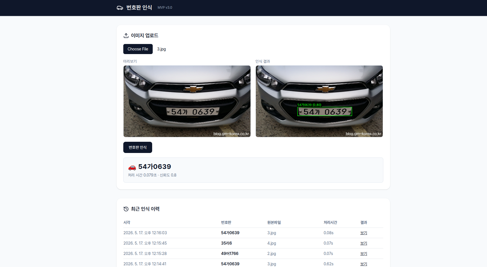

# YOLOv8 번호판 인식 시스템

[](https://www.python.org/downloads/)
[](https://fastapi.tiangolo.com/)
[](https://react.dev/)
[](https://github.com/ultralytics/ultralytics)
[](https://opensource.org/licenses/MIT)

**FastAPI + React 기반 한국 차량 번호판 자동 인식 시스템 (v3.0)**

YOLOv8 검출 → 다중 OCR 엔진(Pororo / PaddleOCR / EasyOCR / Tesseract) auto-fallback → SQLite 저장 → React SPA 로 시각화하는 **단일 사용자 MVP** 풀스택 애플리케이션입니다.



> 위 화면은 이미지를 업로드해 번호판을 인식하고 결과 이미지·이력을 확인하는 SPA UI 예시입니다.

---

## 목차

- [핵심 기능](#핵심-기능)
- [아키텍처 개요](#아키텍처-개요)
- [디렉토리 구조](#디렉토리-구조)
- [빠른 시작](#빠른-시작)
- [실행 방법](#실행-방법)
- [REST API](#rest-api)
- [Python API](#python-api)
- [설정](#설정)
- [OCR 엔진 설치](#ocr-엔진-설치)
- [시스템 요구사항](#시스템-요구사항)
- [문제 해결](#문제-해결)
- [추가 문서](#추가-문서)

---

## 핵심 기능

### 3단 검출(Detection) Fallback
1. **YOLOv8** — `license_plate_det_yolov8.pt` 가중치로 1차 검출 (없으면 HuggingFace Hub 에서 자동 다운로드)
2. **고급 OpenCV** — top-hat/black-hat → adaptive threshold → contour → 문자 그룹핑 → 회전 보정
3. **기본 OpenCV** — Canny + aspect-ratio 필터 (최후 fallback)

### 다중 OCR Auto-fallback
초기화 우선순위: **Pororo → PaddleOCR → EasyOCR → Tesseract**
첫 번째로 초기화 성공한 엔진을 자동 선택하며, `OCR_ENGINE` 환경변수로 명시 지정도 가능.

### 고급 Tesseract 파이프라인 (옵션)
- 4단계 스케일(120/150/300/450px) × 5종 전처리 변형 = 20장
- PSM 6/7/8 모드 조합 → 총 60회 OCR 수행
- 유효 번호판 패턴(`\d{2,3}[가-힣]\d{4}`) 빈도 기반 투표로 최적 결과 선택

### 풀스택 UI
- **백엔드**: FastAPI + uvicorn (port `8000`)
- **프런트엔드**: React 18 + TypeScript + Vite + Tailwind CSS (dev port `5173`)
- **운영 빌드**: FastAPI 가 `frontend/dist` 를 동일 origin 으로 정적 서빙

### 안전한 단일 사용자 MVP 운영
- 업로드 경로 탈출 방지 (`Path.resolve()` 검증)
- 확장자 화이트리스트, 파일 크기 한도(`MAX_UPLOAD_MB`)
- 처리 직후 업로드 파일 자동 삭제 + lifespan 시 오래된 파일 청소
- 모듈 전역 `inference_lock` 으로 비-스레드세이프 모델 호출 직렬화

---

## 아키텍처 개요

```
[Browser] ──/api──► [FastAPI :8000] ──► [Recognizer (YOLO + OCR)]
                          │
                          ├──► [SQLite: license_plates.db]
                          └──► [StaticFiles: frontend/dist] (운영)
```

자세한 레이어 구성·요청 흐름·데이터 모델·확장 포인트는 [`docs/ARCHITECTURE.md`](docs/ARCHITECTURE.md), UML 다이어그램은 [`docs/UML.md`](docs/UML.md) 를 참고하세요.

---

## 디렉토리 구조

```
yolov8-license-plate-recognition/
├── Makefile                  # dev / build / prod 통합 워크플로
├── README.md
├── demo.png                  # UI 데모 스크린샷
├── docs/
│   ├── ARCHITECTURE.md       # 시스템 아키텍처 문서
│   └── UML.md                # Mermaid UML 다이어그램
├── backend/
│   ├── main.py               # FastAPI 진입점 (uvicorn main:app)
│   ├── api/
│   │   ├── routes.py         # /api/detect, /history, /statistics, /health
│   │   ├── deps.py           # 싱글톤 (recognizer, db, inference_lock)
│   │   ├── schemas.py        # Pydantic v2 요청/응답 모델
│   │   └── settings.py       # pydantic-settings (.env / 환경변수)
│   ├── license_plate_recognizer.py  # YOLO + OCR 통합 엔진
│   ├── database_manager.py   # SQLite CRUD + PlateDetection
│   ├── batch_processor.py    # CLI 배치 처리
│   ├── pororo/               # Vendored Pororo OCR
│   ├── uploads/              # 임시 업로드 (자동 삭제)
│   ├── logs/                 # RotatingFileHandler 로그
│   ├── license_plates.db     # SQLite DB
│   └── license_plate_det_yolov8.pt
└── frontend/
    ├── index.html
    ├── vite.config.ts        # /api → http://127.0.0.1:8000 proxy
    └── src/
        ├── App.tsx           # 업로드 + 결과 + 이력 UI
        └── api/client.ts     # axios 기반 API 클라이언트
```

---

## 빠른 시작

### 1. 의존성 설치

```bash
# Python 3.10 가상환경 (예: conda)
conda create -n py310_pt python=3.10 -y
conda activate py310_pt

# 백엔드 + 프런트엔드 일괄 설치
make install
```

`make install` 은 내부에서 다음을 실행합니다.
```bash
python -m pip install -r backend/requirements.txt
cd frontend && npm install
```

> CUDA 빌드의 PyTorch 가 필요한 경우 공식 인덱스로 별도 설치를 권장합니다.
> `pip install torch torchvision --index-url https://download.pytorch.org/whl/cu121`

### 2. 환경변수 설정 (선택)

`backend/.env.example` 을 복사해 `backend/.env` 를 만들고 필요한 값만 덮어씁니다.

```bash
cp backend/.env.example backend/.env
```

### 3. 실행

```bash
make dev      # FastAPI (8000) + Vite (5173) 동시 기동
```

브라우저에서 **http://localhost:5173** 접속 → 이미지 업로드 → 결과 확인.

---

## 실행 방법

| 명령 | 설명 |
|---|---|
| `make install` | backend(pip) + frontend(npm) 의존성 설치 |
| `make dev` | FastAPI(uvicorn --reload) + Vite 동시 실행 (Ctrl-C 한 번에 종료) |
| `make backend-dev` | FastAPI 단독 (port 8000, reload) |
| `make frontend-dev` | Vite 단독 (port 5173, /api 프록시) |
| `make build` | 프런트엔드 운영 빌드 → `frontend/dist` |
| `make prod` | 빌드된 SPA + uvicorn 단일 워커로 동일 origin 서빙 |
| `make clean` | `dist/`, `__pycache__`, `*.pyc` 제거 |

운영 모드에서는 FastAPI 가 `/api/*` 외 모든 경로에 대해 `frontend/dist` 를 서빙하므로 별도 웹서버 없이 단일 호스트로 동작합니다.

---

## REST API

베이스 URL: `http://127.0.0.1:8000/api`
대화형 문서: `http://127.0.0.1:8000/docs` (Swagger UI)

| 메서드 | 경로 | 설명 |
|---|---|---|
| `POST` | `/api/detect` | 이미지 업로드 + 번호판 인식 + DB 저장 |
| `GET` | `/api/results/{id}/image` | 저장된 결과 이미지(JPEG) 스트리밍 |
| `GET` | `/api/history?plate_number=&limit=` | 인식 이력 조회 (최대 500건) |
| `GET` | `/api/statistics` | 통계 (총 검출/유니크/오늘/평균 신뢰도·처리시간) |
| `GET` | `/api/health` | 헬스체크 (`SELECT 1` 기반) |

### 예시 — Python

```python
import requests

# 1) 업로드 + 인식
with open("car.jpg", "rb") as f:
    res = requests.post(
        "http://127.0.0.1:8000/api/detect",
        files={"image": f},
    ).json()

print(res["plate_number"], res["processing_time"])
# → '49허1769' 0.382

# 2) 결과 이미지 다운로드
img_url = f"http://127.0.0.1:8000{res['result_image_url']}"
open("result.jpg", "wb").write(requests.get(img_url).content)

# 3) 이력 조회
history = requests.get(
    "http://127.0.0.1:8000/api/history",
    params={"limit": 10},
).json()
```

### 예시 — curl

```bash
curl -F image=@car.jpg http://127.0.0.1:8000/api/detect
curl http://127.0.0.1:8000/api/history?limit=10
curl http://127.0.0.1:8000/api/statistics
curl http://127.0.0.1:8000/api/health
```

---

## Python API

CLI 나 노트북에서 직접 엔진을 사용하는 경우.

```python
from backend.license_plate_recognizer import YOLOv8LicensePlateRecognizer

recognizer = YOLOv8LicensePlateRecognizer(
    yolo_model_path="backend/license_plate_det_yolov8.pt",
    ocr_engine="auto",            # pororo / paddleocr / easyocr / tesseract / auto
    confidence_threshold=0.3,
    use_advanced_preprocessing=True,
)

plate_text, result_img = recognizer.process_image("car.jpg", save_result=False)
print(plate_text)
```

---

## 설정

`backend/api/settings.py` 가 `.env` 와 환경변수를 통합합니다 (pydantic-settings v2).

| 키 | 기본값 | 설명 |
|---|---|---|
| `HOST` / `PORT` | `127.0.0.1` / `8000` | 외부 노출은 reverse proxy 권장 |
| `SECRET_KEY` | 무작위 hex (dev) | 운영 시 반드시 환경변수 주입 |
| `UPLOAD_FOLDER` | `backend/uploads` | |
| `MAX_UPLOAD_MB` | `16` | 초과 시 413 |
| `ALLOWED_EXTENSIONS` | `.jpg/.jpeg/.png/.bmp/.tiff` | |
| `CLEANUP_AGE_HOURS` | `24` | lifespan 시 오래된 업로드 자동 청소 |
| `DELETE_AFTER_PROCESS` | `true` | 처리 직후 즉시 삭제 |
| `DB_PATH` | `backend/license_plates.db` | |
| `YOLO_MODEL_PATH` | `backend/license_plate_det_yolov8.pt` | 없으면 HF Hub 자동 다운로드 |
| `CONFIDENCE_THRESHOLD` | `0.3` | YOLO 임계값 |
| `OCR_ENGINE` | `auto` | `pororo` / `paddleocr` / `easyocr` / `tesseract` |
| `CORS_ORIGINS` | `localhost:5173`, `127.0.0.1:5173` | Vite dev 한정 |
| `LOG_LEVEL` / `LOG_FILE` | `INFO` / `logs/...log` | RotatingFileHandler (10MB × 5) |

`backend/config.yaml` 은 레거시 호환용 (`config_manager.py`) 으로 유지됩니다.

---

## OCR 엔진 설치

`requirements.txt` 에는 Tesseract 만 기본 포함됩니다. 다른 엔진은 필요 시 별도 설치하세요. Pororo OCR 은 본 저장소에 vendored 되어 별도 설치가 필요하지 않습니다 (`backend/pororo/`).

### Tesseract (기본)
```bash
# Ubuntu / Debian
sudo apt-get install tesseract-ocr tesseract-ocr-kor

# macOS
brew install tesseract tesseract-lang
```

### PaddleOCR (옵션)
```bash
pip install paddleocr paddlepaddle-gpu  # GPU
# 또는
pip install paddleocr paddlepaddle      # CPU
```

### EasyOCR (옵션)
```bash
pip install easyocr
```

### 한글 폰트 (결과 이미지 텍스트)
```bash
sudo apt-get install fonts-nanum fonts-nanum-coding
fc-cache -fv
```

---

## 시스템 요구사항

### 최소
- Python **3.10** (vendored Pororo 호환성 기준)
- RAM 4 GB
- 디스크 2 GB
- Node.js **18.18+** (프런트엔드 빌드)

### 권장
- Python 3.10 + PyTorch 2.x + CUDA 12.1
- NVIDIA GPU (예: RTX 4060 / Ada Lovelace)
- RAM 8 GB+

---

## 문제 해결

### 1. YOLO 모델 자동 다운로드 실패
HuggingFace Hub 접근이 막혀 있으면 `_ensure_model_exists` 가 `yolov8n.pt` 로 fallback 됩니다.
수동 배치를 권장: `backend/license_plate_det_yolov8.pt` 에 직접 두세요.

### 2. OCR 엔진이 모두 실패 → `OCR_NOT_AVAILABLE`
- Pororo: `backend/pororo/` 디렉토리가 손상되지 않았는지 확인
- Tesseract: `tesseract --list-langs | grep kor` 로 한국어 팩 확인
- 엔진 명시 지정: `OCR_ENGINE=tesseract` 등으로 강제

### 3. 한글이 결과 이미지에서 깨짐
NanumGothic 또는 NotoSansCJK 폰트를 설치한 뒤 `fc-cache -fv` 실행.

### 4. CUDA OOM
```bash
export GPU_MEMORY_FRACTION=0.5
```
또는 CPU 강제: 모델 로드 전 `CUDA_VISIBLE_DEVICES=""` 환경변수 설정.

### 5. 업로드 415/413
- 413: `MAX_UPLOAD_MB` 초과 → 환경변수로 상향 조정
- 400: 확장자가 화이트리스트(`ALLOWED_EXTENSIONS`) 에 없음

---

## 추가 문서

- [`docs/ARCHITECTURE.md`](docs/ARCHITECTURE.md) — 시스템 아키텍처 (레이어, 데이터 모델, 보안, 배포)
- [`docs/UML.md`](docs/UML.md) — UML 다이어그램 (Use Case, Component, Class, Sequence, Activity, State, ER, Deployment)

---

## 라이선스

MIT — 자세한 내용은 [`LICENSE`](LICENSE) 파일 참조.
