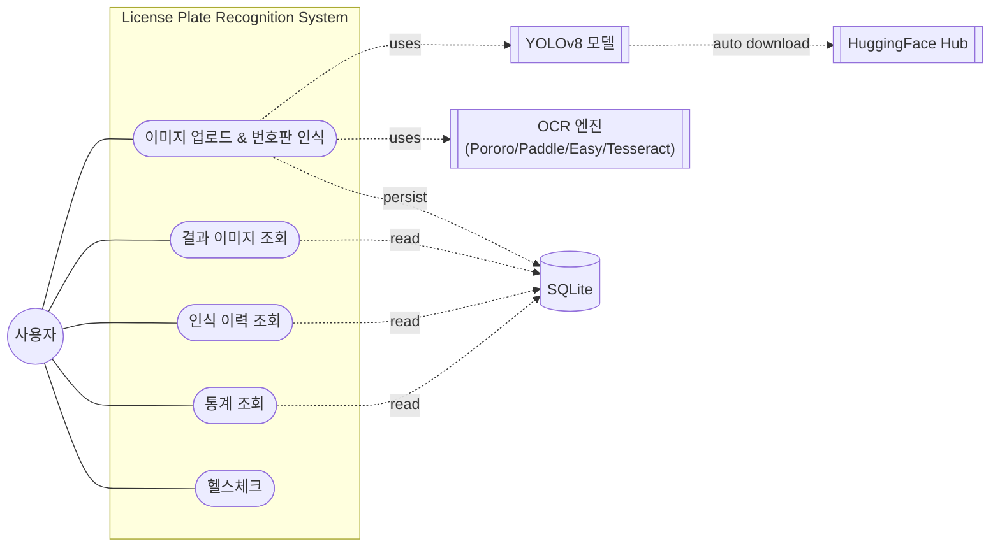
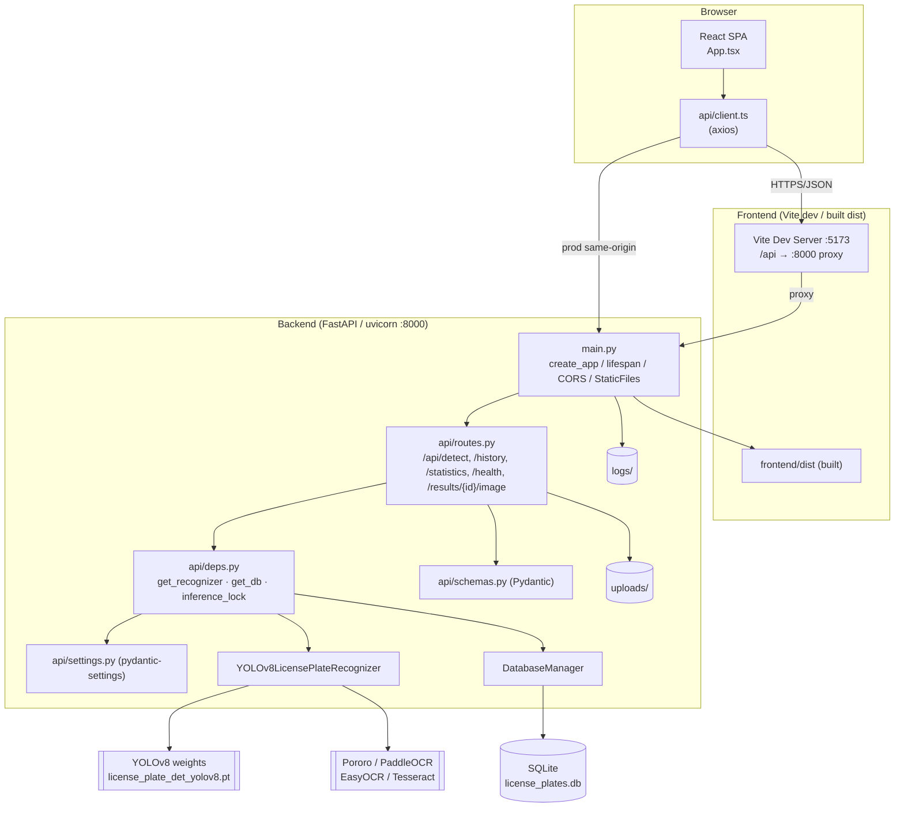
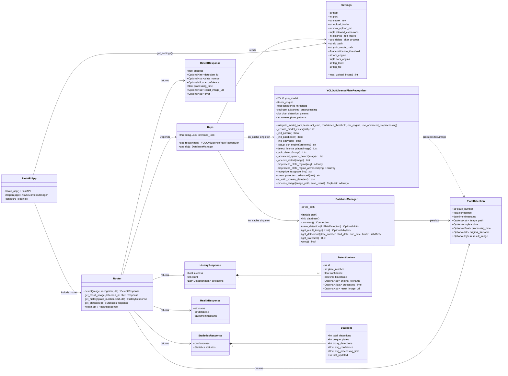
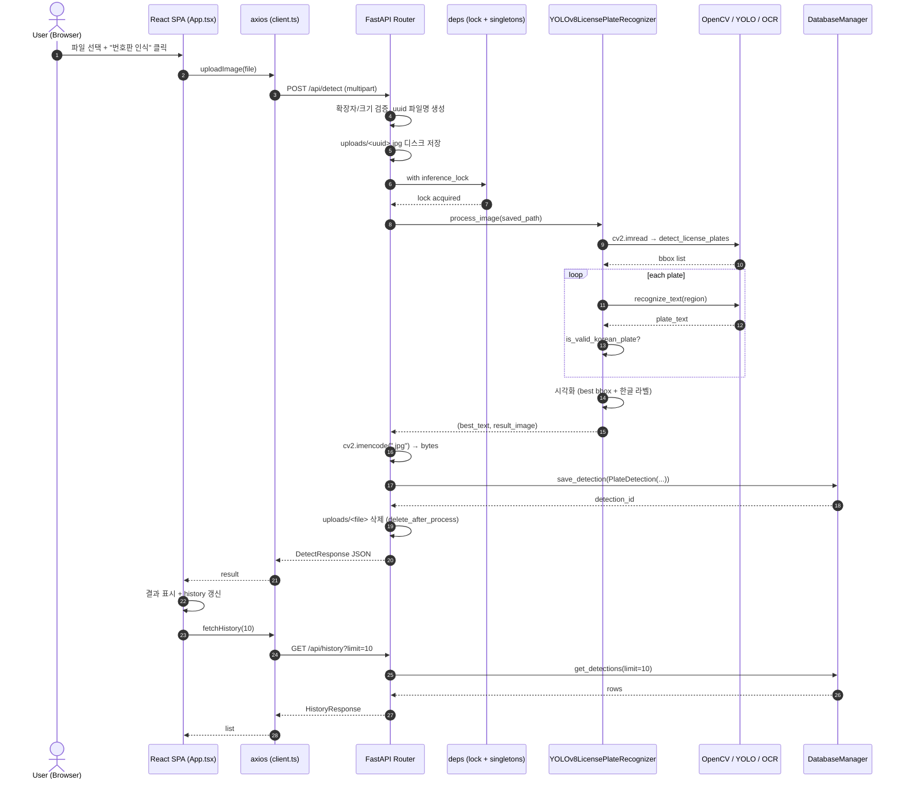
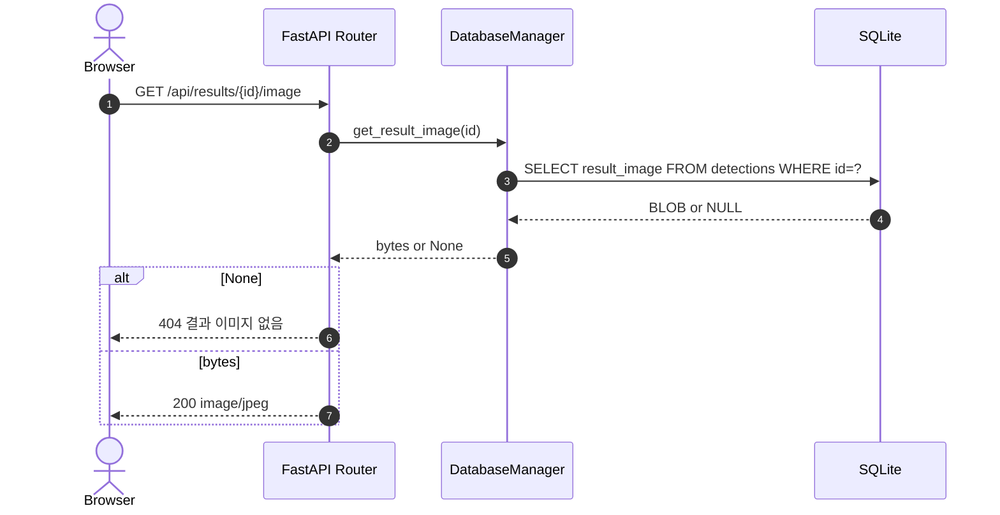
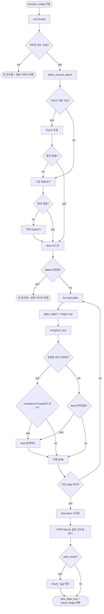
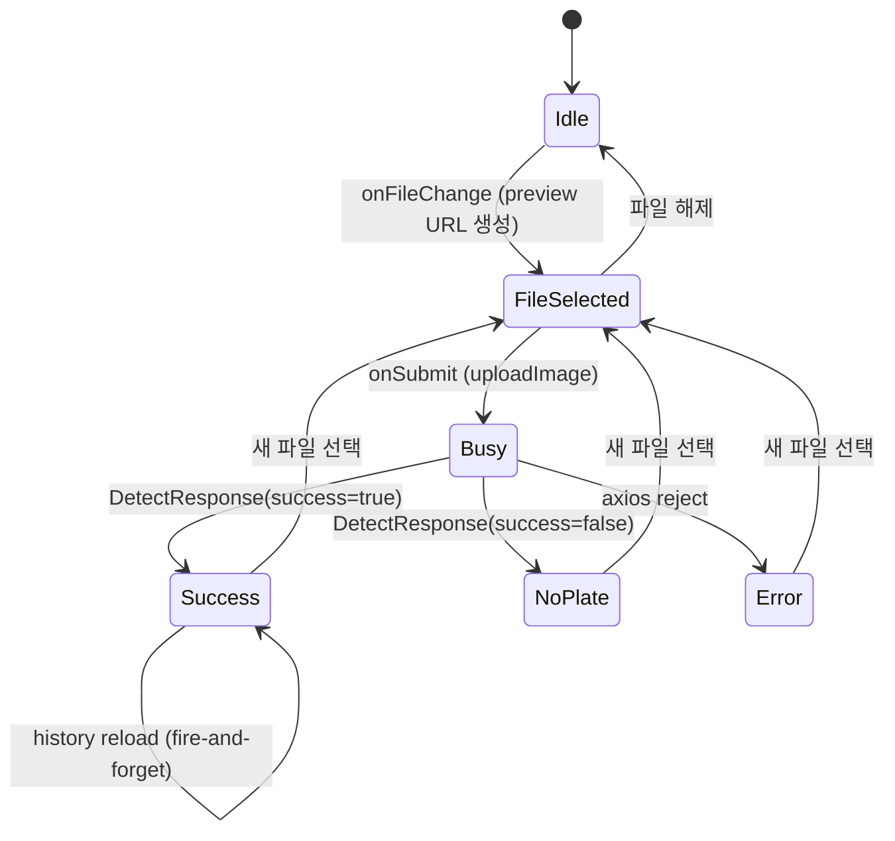
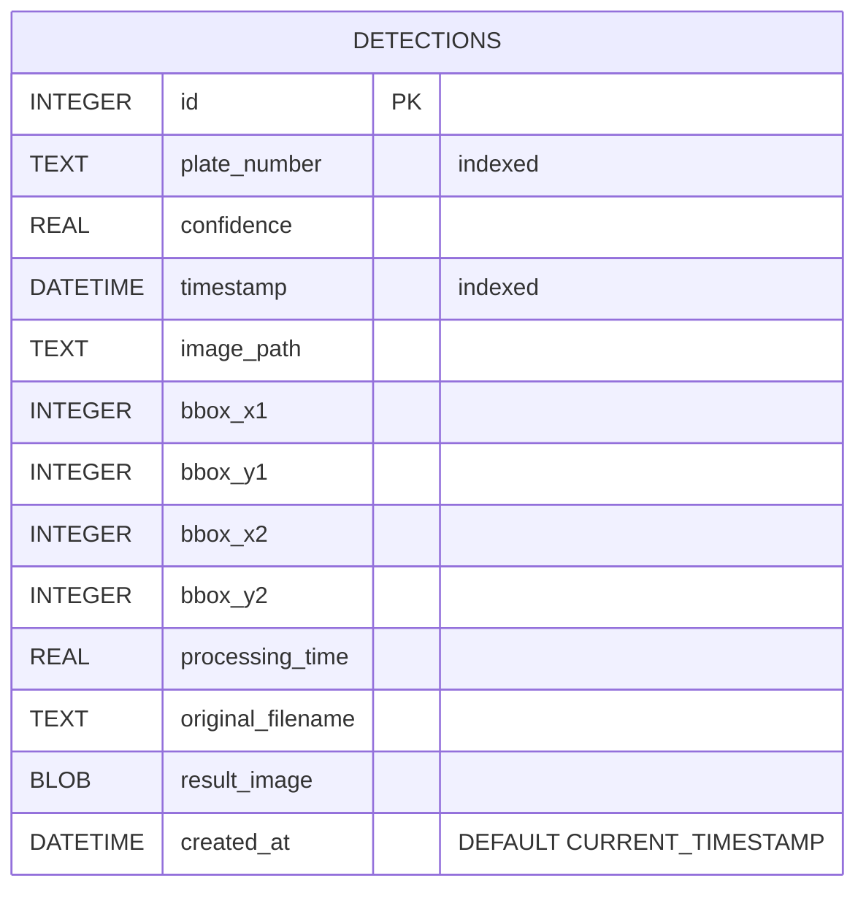
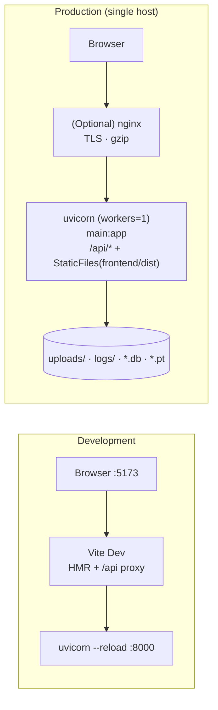

# UML 다이어그램

> 본 문서는 Mermaid 로 작성되었으며, GitHub / VS Code Markdown Preview / IntelliJ 등에서 바로 렌더링된다.

## 1. Use Case Diagram

---

## 2. Component Diagram

---

## 3. Class Diagram

---

## 4. Sequence Diagram — `POST /api/detect`

---

## 5. Sequence Diagram — `GET /api/results/{id}/image`

---

## 6. Activity Diagram — `process_image` 파이프라인

---

## 7. State Diagram — Frontend 업로드 화면

---

## 8. ER Diagram — SQLite `detections`

> 단일 테이블 — 사용자/세션/이미지 메타 정규화는 MVP 범위 밖. 결과 이미지는 BLOB 으로 동일 행에 저장되어 단일 사용자 규모에서 분산 스토리지의 복잡도를 회피한다.

---

## 9. Deployment Diagram

> 운영은 단일 워커 + threadpool + `inference_lock` 으로 모델 호출을 직렬화하는 단일 호스트 구성. 수평 확장이 필요하면 모델 호출을 큐(Redis + arq/Celery)로 분리하고 DB 를 PostgreSQL 로 마이그레이션하는 것이 다음 단계.
